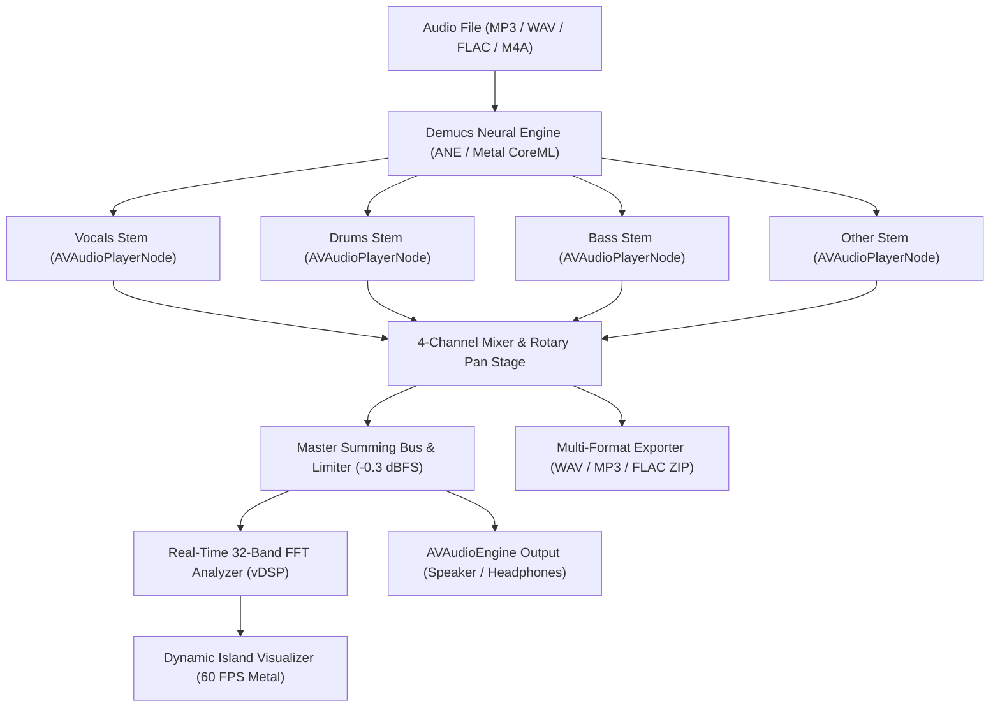

# ISOLATE

> **Raw, zero-latency 4-stem audio isolation for macOS.**  
> Powered by Demucs v4 Neural Engine CoreML & Nothing OS hardware aesthetics.

[](https://github.com/TheConfidentCoder/Isolate)
[](https://github.com/TheConfidentCoder/Isolate)
[](https://github.com/TheConfidentCoder/Isolate/releases/latest)
[](LICENSE)

---

## [ 01. HIGHLIGHTS ]

- **4-Stem Neural Isolation**: Surgically separate any track into **Vocals**, **Drums**, **Bass**, and **Other** with Hybrid Demucs v4 on Apple Silicon Neural Engine (ANE / Metal CoreML).
- **Tactical Hardware Mixer**: Dynamic tactile faders, 1.2s peak-hold clip LEDs, dual decibel (`0.0 dB`) / linear percentage readouts, single-click **[M]** Mute, and exclusive **[S]** Solo routing.
- **Rotary Stereo Pan Dials**: Channel pan knobs (`‹ C ›`, `‹ 42L`, `28R ›`) featuring magnetic haptic center snap.
- **Top Header Space & Telemetry HUD**: 32-band real-time FFT spectrum visualizer, ANE neural status, chip telemetry (M1–M5 / A18 Pro), tempo / key indicators, and one-click stem macro toggles (`[ ACAPELLA ]`, `[ INSTRUMENTAL ]`, `[ DRUMLESS ]`, `[ KARAOKE ]`, `[ D&B ]`, `[ RESET ]`).
- **Live A-B Region Looper**: Real-time loop boundary setting on the fly with dedicated hotkeys (`[` and `]`).
- **macOS Menu Bar Mini Controller**: Status bar controller with an animated 3-bar equalizer and native completion notifications.
- **Resilient Multi-Token Library Search**: Instant filtering across track names, artists, and filenames.
- **Modern macOS 26 & 27 Design**: Squircle app icon and zero-latency Nothing hardware aesthetic.

---

## [ 02. SYSTEM REQUIREMENTS & DEPENDENCIES ]

### Minimum System Requirements

| Component | Minimum Specification | Recommended |
| :--- | :--- | :--- |
| **Operating System** | macOS 14.0 (Sonoma) | macOS 15.0 (Sequoia) or newer |
| **Processor (Architecture)** | Apple Silicon (M1 / M2 / M3 / M4 / M5) or Intel Core | Apple Silicon with Apple Neural Engine (ANE) |
| **Unified Memory (RAM)** | 8 GB Unified Memory | 16 GB or higher for multi-track batch processing |
| **Available Storage** | 1.0 GB free disk space | 5.0 GB+ for processed high-res stem library |
| **Audio Hardware** | Built-in macOS audio or CoreAudio interface | 24-bit / 44.1 kHz+ CoreAudio DAC / Headphones |

> [!NOTE]  
> **Running the Pre-Built App**: `Isolate.app` is a self-contained native Swift/Metal/CoreML binary. **No external runtimes (such as Python, Node.js, or Docker) are required to run the app.**

---

### Development & Build Dependencies

If you are developing, contributing, or building Isolate from source, the following tools and verified setup links are required:

| Tool | Purpose | Installation Guide & Verified Link |
| :--- | :--- | :--- |
| **Homebrew** | macOS package manager for developer tools | [brew.sh](https://brew.sh) &bull; `/bin/bash -c "$(curl -fsSL https://raw.githubusercontent.com/Homebrew/install/HEAD/install.sh)"` |
| **Apple Xcode** | Swift 5.10+ compiler and macOS SDK | [developer.apple.com/xcode](https://developer.apple.com/xcode/) or run `xcode-select --install` |
| **XcodeGen** | Generates the `.xcodeproj` from `project.yml` | [github.com/yonaskolb/XcodeGen](https://github.com/yonaskolb/XcodeGen) &bull; `brew install xcodegen` |
| **Node.js** | Used for CI runner scripts, GitHub Actions, and release tooling | [nodejs.org](https://nodejs.org) (v22 LTS / v24) &bull; `brew install node` |
| **Git** | Distributed source version control | [git-scm.com](https://git-scm.com) &bull; `brew install git` |

---

## [ 03. INSTALLATION & PACKAGES ]

### Option A: Instant 1-Line Terminal Install (Recommended)

Installs `Isolate.app` directly into `/Applications` and automatically removes the macOS quarantine attribute:

```bash
curl -fsSL https://raw.githubusercontent.com/TheConfidentCoder/Isolate/main/install.sh | bash
```

---

### Option B: Homebrew Cask

```bash
brew install --cask TheConfidentCoder/isolate/isolate
```

Or tap the repository directly:
```bash
brew tap TheConfidentCoder/isolate https://github.com/TheConfidentCoder/Isolate
brew install --cask isolate
```

---

### Option C: Pre-Built DMG Installer

1. Download **`Isolate.dmg`** from [GitHub Releases](https://github.com/TheConfidentCoder/Isolate/releases/latest).
2. Open the disk image and drag **`Isolate.app`** into **`Applications`**.
3. Launch `Isolate.app`.

> [!NOTE]  
> If macOS displays *"Apple could not verify Isolate.app is free of malware"*:
> - **Option 1 (Instant Fix)**: Run `xattr -cr /Applications/Isolate.app` in Terminal.
> - **Option 2 (System Settings)**: Open **System Settings** → **Privacy & Security** → click **Open Anyway**.

---

### Option D: Build from Source

#### Prerequisites
- macOS 14.0 (Sonoma) or newer
- Xcode 15.4 or Xcode 16+
- [XcodeGen](https://github.com/yonaskolb/XcodeGen) (`brew install xcodegen`)

```bash
# 1. Clone the repository
git clone https://github.com/TheConfidentCoder/Isolate.git
cd Isolate

# 2. Generate Xcode project
xcodegen generate

# 3. Build & Run
xcodebuild -scheme Isolate -configuration Release -destination 'platform=macOS' build
open build/Release/Isolate.app
```

---

## [ 04. KEYBOARD SHORTCUTS ]

| Action | Shortcut | Description |
| :--- | :--- | :--- |
| **Play / Pause** | `Space` | Toggle global audio playback |
| **Solo Stem (1 - 4)** | `1` / `2` / `3` / `4` | Exclusive solo for Vocals, Drums, Bass, Other |
| **Mute Stem (V / D / B / O)** | `V` / `D` / `B` / `O` | Toggle mute for individual stem channels |
| **Switch Studio HUD Modes** | `⌘1` / `⌘2` / `⌘3` / `⌘4` | Switch HUD: 32-Band FFT, Stem Macros, Stem Balance, Telemetry |
| **Set Loop In / Out** | `[` / `]` | Mark A-B loop start and end points on the fly |
| **Toggle Loop** | `L` | Toggle active A-B region loop on/off |
| **Acapella / Instrumental / Reset** | `A` / `I` / `R` | Trigger stem macros immediately |
| **Bypass Toggle** | `B` | Toggle between raw original master and stem mix |
| **Shortcut Cheat Sheet HUD** | `?` or `/` | Toggle in-app floating Nothing OS shortcuts card |
| **Export Stems** | `E` | Export 4-stem multi-format audio bundle |
| **Import Audio** | `⌘O` | Open file picker for single or batch stem separation |
| **Fader Reset to 100%** | `Double-Click` | Double-click fader thumb or volume number to reset to unity |
| **Dismiss / Close** | `Esc` | Cancel / dismiss active modal card |

---

## [ 05. ARCHITECTURE ]

```
Isolate/
├── Sources/
│   ├── App/
│   │   ├── IsolateApp.swift        # App entry point, scene hierarchy, and modal cards
│   │   ├── AudioEngineManager.swift # Low-latency 4-track AVAudioEngine DSP graph
│   │   ├── DemucsEngine.swift      # CoreML Demucs v4 Neural Engine inference pipeline
│   │   ├── AppMoveHelper.swift     # Automatic /Applications installation & DMG eject
│   │   └── Haptics.swift           # Mechanical tactile feedback synthesis
│   ├── Player/
│   │   ├── PlayerView.swift        # Mixer channel strips, transport bar, FFT visualizer
│   │   ├── CustomFader.swift       # Hardware faders with drag gestures & haptic detents
│   │   └── SpectrumVisualizer.swift# Live Accelerate vDSP FFT dot-matrix visualizer
│   ├── Library/
│   │   ├── LibraryView.swift       # Track list, 3-dots action menu, rename, delete
│   │   └── TrackModel.swift        # SwiftData persistent schema
│   └── Resources/
│       ├── DotGothic16-Regular.ttf # Nothing OS dot-matrix typography
│       └── HTDemucs.mlmodelc/      # Quantized Demucs CoreML Neural Engine model
├── Casks/
│   └── isolate.rb                  # Official Homebrew Cask formula
├── scripts/
│   ├── package_release.sh          # Automated Release DMG & ZIP builder
│   └── generate_assets.swift       # Nothing OLED DMG wallpaper & icon generator
├── Tests/                          # XCTest unit test suite
└── .github/workflows/              # Automated CI/CD release workflow
```

### [ Audio DSP & Neural Pipeline ]



---

## [ 06. CREDITS & LICENSE ]

- **Demucs**: Hybrid Transformer Demucs by Alexandre Défossez ([Meta AI Research](https://github.com/facebookresearch/demucs)).
- **Typography**: [DotGothic16](https://fonts.google.com/specimen/DotGothic16) font by Fontworks Inc.
- **License**: Released under the [MIT License](LICENSE).
