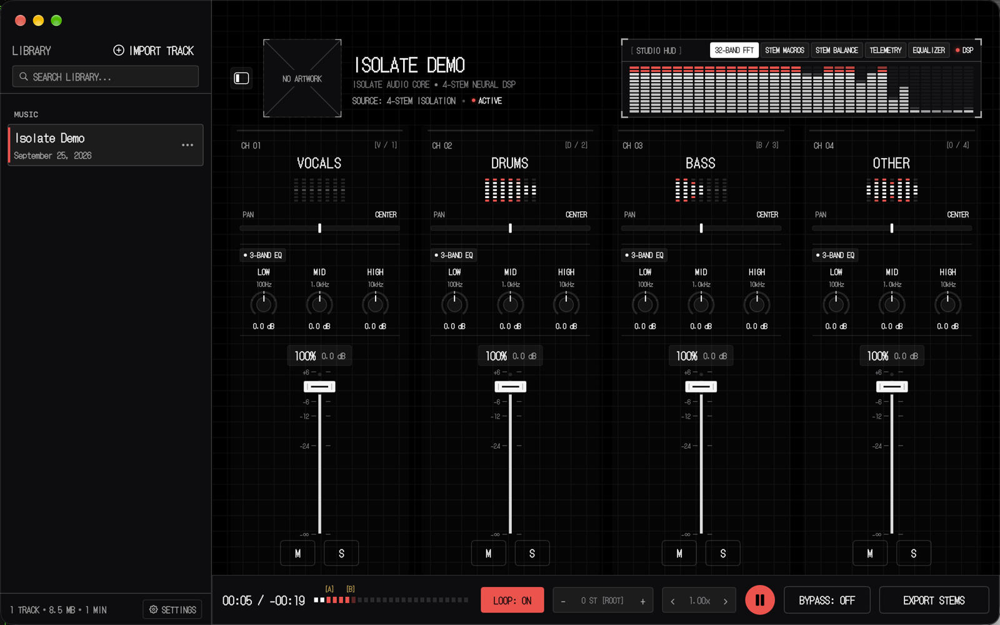

# Isolate

**Split a song into vocals, drums, bass and other on your Mac, then mix, loop, slow down and export the stems.**

Isolate is a native macOS stem player for Apple silicon. It runs HTDemucs, the open-source separation model from Meta's Demucs project, through Core ML, so songs are separated on your own Mac with no account and no upload. Once a song is split, four channel strips let you solo the bass line, mute the vocals to sing along, slow a solo to 0.75× without changing its pitch, loop the hard part, and export the stems or your own mix. The interface is a hardware-style mixer inspired by Nothing's dot-matrix design.

<picture>
  <source media="(prefers-color-scheme: dark)" srcset="Assets/screenshot-dark.png">
  <source media="(prefers-color-scheme: light)" srcset="Assets/screenshot-light.png">
  
</picture>

**[Download Isolate for macOS](https://github.com/neokumar1/Isolate/releases/latest)** · Apple silicon · macOS 14 or later · Free and open source (MIT)

## Download

1. Download **[Isolate.dmg](https://github.com/neokumar1/Isolate/releases/latest/download/Isolate.dmg)** from the [latest release](https://github.com/neokumar1/Isolate/releases/latest).
2. Open it and drag **Isolate** into **Applications**.
3. Open Isolate from Applications and approve it once, as described in [First launch](#first-launch).

| | |
| --- | --- |
| Requires | A Mac with Apple silicon (M1 or later) and macOS 14 Sonoma or later |
| Download | About 160 MB |
| Installed | About 300 MB, including the separation model |
| Separated songs | About 106 MB of disk per minute of audio, kept until you delete the song |

Each release lists SHA-256 checksums in `SHA256SUMS.txt`. To check your download, run `shasum -a 256 ~/Downloads/Isolate.dmg` and compare the result. Homebrew, a terminal installer and source builds are covered in [INSTALL.md](INSTALL.md).

## First launch

Isolate's releases are built by GitHub Actions from this repository and are ad-hoc signed. They are not signed with an Apple Developer ID or notarized by Apple, so macOS can't confirm who made the app and blocks the first launch until you approve it. You do this once for each new version.

### macOS 15 Sequoia and later

1. Open Isolate from Applications. macOS says **"Isolate" Not Opened** because Apple could not verify it. Click **Done**, not Move to Trash.
2. Open **System Settings › Privacy & Security** and scroll down to **Security**.
3. Next to the message that Isolate was blocked, click **Open Anyway**. The button only appears for a while after a blocked launch; if it isn't there, repeat step 1.
4. Enter your login password or use Touch ID.
5. When macOS asks one last time, click **Open**.

From then on, Isolate opens like any other app.

### macOS 14 Sonoma

In Applications, Control-click (or right-click) **Isolate**, choose **Open**, then click **Open** in the dialog.

### Please don't turn off Gatekeeper

Don't disable Gatekeeper (for example with `spctl --master-disable`) or strip quarantine attributes with `xattr` to skip these steps. Those commands change security checks for every app on your Mac, while the steps above approve only Isolate. If you'd rather not run a prebuilt app, check the download against `SHA256SUMS.txt` or [build Isolate from source](INSTALL.md#build-from-source).

If you open Isolate straight from the disk image, it offers to move itself into Applications.

## What it does

**Separate**

- Four stems, always in the same order: vocals, drums, bass and other. HTDemucs runs through Core ML on your Mac. Isolate has no account, analytics or network features of its own.
- Import files or whole folders with ⌘O or by dragging them onto the window. MP3, WAV, FLAC, M4A (AAC or ALAC), AIFF and CAF are supported. Surround files are downmixed to stereo, and iCloud Drive files that aren't on your Mac yet are downloaded first.
- While a song separates, Isolate shows the file name, chunk count, time remaining and measured speed. You can cancel one song or a whole batch, and if you allow notifications, Isolate tells you when an import finishes while it is in the background.
- Separated songs are cached by their audio content. Importing the same audio again, even from a different folder, reuses its stems instead of separating it again.

**Mix**

- Four channel strips, each with a fader from −60 to +6 dB (the bottom is silence), mute, solo, stereo pan and a live meter.
- Three-band EQ on every stem and on the master bus: a 100 Hz low shelf, a 1 kHz bell and a 10 kHz high shelf, each ±12 dB. It includes factory presets, per-channel bypass and one key (⌘E) to bypass all EQ.
- One-click macros: Acapella, Instrumental, Drumless, Karaoke (vocals at −12 dB), Drums & Bass, and Reset.
- Compare Original (the **BYPASS** button) switches to the source recording under the same speed, pitch and master EQ, so you can check the separation against the real thing.

**Practice**

- Speed from 0.5× to 1.5× (0.5, 0.75, 0.85, 1, 1.15, 1.25 and 1.5) without changing pitch, and pitch from −12 to +12 semitones without changing speed.
- A–B loop: set the start and end at the playhead with [ and ], turn looping on or off with L, and clear the markers with ⌥L.
- A studio display above the mixer with five views: a 32-band spectrum, the stem macros, stem balance, telemetry (tempo, key, format and timecode) and the master equalizer (⌘1 to ⌘5).

**Library**

- Songs are grouped by the folder they came from and can be searched by title, file name or folder. Next and Previous follow the sidebar order.
- Artist, album, artwork, BPM and key come from the file's own tags. Isolate doesn't estimate BPM or key, and shows them as unknown when the tags don't have them.
- Rename songs in the library. Deleting a song removes only the stems Isolate made; your original file is never changed or deleted.

**Export**

- **Stems:** a ZIP of four 24-bit WAV or FLAC files at 44.1 kHz. Channel EQ is included unless it is bypassed; levels, pan, speed and pitch are not. If any stem would clip, all four are lowered by the same amount so they still add up to the same mix.
- **Mix:** a 24-bit WAV of the whole track with your current levels, mutes, solos, pan, EQ, speed and pitch. With Compare Original on, it exports the original recording instead and names the file `_Original.wav`.
- Exports show their progress and can be cancelled. An existing file is replaced only after the new one is complete.

**On your Mac**

- Dark, light and match-system themes, with support for Increase Contrast and VoiceOver labels on the controls.
- A menu bar mini controller, media keys and Now Playing, and trackpad haptics.

## Keyboard shortcuts

| Keys | Action |
| --- | --- |
| Space | Play or pause |
| 1, 2, 3, 4 | Solo vocals, drums, bass or other |
| V, D, B, O | Mute vocals, drums, bass or other |
| A / I | Acapella (vocals only) / Instrumental (no vocals) |
| R | Reset levels, mutes, solos and pan |
| [ / ] | Set the loop start / end at the playhead |
| L | Turn the A–B loop on or off |
| ⌥L | Clear the loop markers |
| ⌘1 to ⌘5 | Studio display: 32-band FFT, stem macros, stem balance, telemetry, equalizer |
| ⌘E | Bypass all EQ (stems and master) |
| ⌥⌘B | Compare Original (BYPASS) |
| ⌘O | Import files or folders |
| ⇧⌘E | Export stems |
| ⇧⌘M | Export mix |
| ⌘B | Show or hide the library |
| ⌘, | Settings |
| ⌘0 | Show the Isolate window |
| ? or / | Show or hide the shortcut card |
| Esc | Close the open panel, or cancel the import in progress |
| Arrow keys | Adjust the focused fader, knob, pan control or seek bar |
| Double-click | Reset a fader, pan control, EQ knob, pitch or speed |

The full list is also in **Settings › Shortcuts**.

## Speed, quality and limits

- **Speed depends on your Mac.** On an M-series MacBook Pro running macOS 27, real songs separated at about 2.5× realtime during v1.3.0 testing: a 4:37 ALAC track in 1:49 and an 8:24 MP3 in 3:17. Those runs were measured before a later optimization and haven't been re-timed. Your speed will vary with the Mac, the macOS version and what else is running; the progress screen shows the measured speed for each song.
- **The first separation after installing or updating is slower** while macOS prepares the model for your Mac. On the test Mac that took about 17 seconds once, and about 3 to 4 seconds on later loads.
- **Memory:** on the test Mac, Core ML used about 1.6 to 2.7 GB during separation. Isolate releases the model after 60 seconds without a separation.
- **Disk:** separated songs use about 106 MB per minute of audio. Isolate checks for enough free space before it starts.
- **Quality depends on the recording.** Expect some bleed between stems and some artifacts, especially on dense mixes. Isolate makes no guarantee about separation quality.
- **Looping is for practice.** Playback that starts from a stop waits a fraction of a second so all four stems start together, and the A–B loop is not a sample-accurate DAW loop.
- **Not supported:** Intel Macs, DRM-protected files (such as Apple Music downloads), OGG and Opus, files with more than 8 channels, MP3 export, and exporting only the loop region.

Having trouble? See [TROUBLESHOOTING.md](TROUBLESHOOTING.md). Changes in each version are listed in [CHANGELOG.md](CHANGELOG.md).

## Build from source

You need Xcode 26.2 or later and [XcodeGen](https://github.com/yonaskolb/XcodeGen). The model weights are not in this repository; [MODEL.md](MODEL.md) explains how to install the validated model.

```sh
brew install xcodegen
xcodegen generate
xcodebuild build -project Isolate.xcodeproj -scheme Isolate \
  -destination 'platform=macOS,arch=arm64' -derivedDataPath build/DerivedData
open build/DerivedData/Build/Products/Debug/Isolate.app
```

[INSTALL.md](INSTALL.md) has the full steps, [RELEASE.md](RELEASE.md) covers tests and packaging, and [ARCHITECTURE.md](ARCHITECTURE.md), [AUDIO_ENGINE.md](AUDIO_ENGINE.md) and [DESIGN.md](DESIGN.md) describe how the app works.

## Credits

- App code: [MIT License](LICENSE), © 2026 Neo Kumar.
- Separation model: HTDemucs from Meta's [Demucs](https://github.com/facebookresearch/demucs) project, MIT License, converted to Core ML.
- Typeface: [DotGothic16](https://github.com/fontworks-fonts/DotGothic16) by Fontworks, SIL Open Font License 1.1.

License texts ship inside the app; see [THIRD_PARTY_NOTICES.md](THIRD_PARTY_NOTICES.md). Isolate is an independent project. It is not affiliated with or endorsed by Nothing Technology Limited or Apple; "Nothing-inspired" describes the visual style only.
