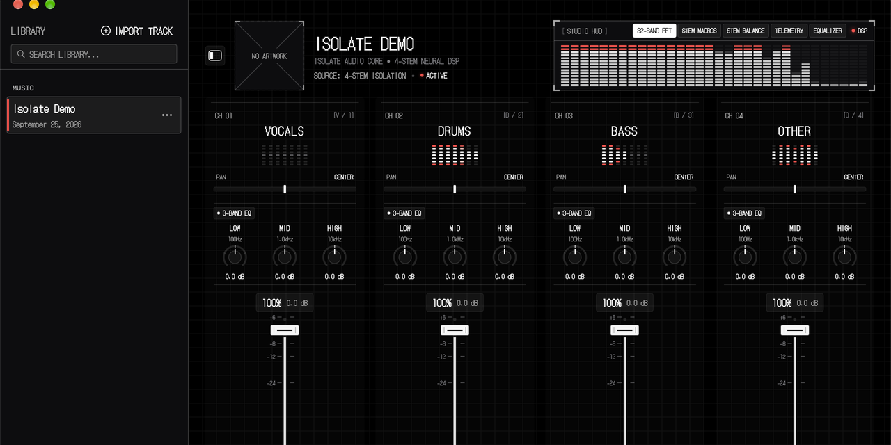

<div align="center">

# ISOLATE

### Raw, zero-latency 4-stem audio isolation workstation for macOS.
**100% on-device neural stem separation &bull; Studio hardware mixer &bull; 3-Band parametric EQ &bull; Nothing OS aesthetic**

<br/>

[](https://github.com/TheConfidentCoder/Isolate/stargazers)
[](https://github.com/TheConfidentCoder/Isolate/releases)
[](https://github.com/TheConfidentCoder/Isolate)
[](https://github.com/TheConfidentCoder/Isolate)
[](LICENSE)
[](https://github.com/TheConfidentCoder/Isolate/releases/latest)

<br/>



<br/>
<br/>

**[Download Isolate for Mac](https://github.com/TheConfidentCoder/Isolate/releases/latest)** &bull; **[Install via Homebrew](#-option-a-homebrew-cask-recommended)** &bull; **[How It Works](#-how-it-works)** &bull; **[Interface Guide](#-what-everything-does-interface-guide)**

</div>

---

## ⚡ What is Isolate?

**Isolate** is a standalone, high-performance audio workstation for macOS that separates any song into **Vocals**, **Drums**, **Bass**, and **Other** instruments in seconds.

Built natively in Swift, Metal, and CoreML, Isolate accelerates state-of-the-art Demucs neural networks directly on your Mac's **Apple Neural Engine (ANE)** and GPU. Your audio is processed **100% locally on your computer** — no cloud servers, no account logins, and no subscriptions.

Whether you are a music producer extracting vocal acapellas, a DJ creating custom drum stems and instrumentals, a musician practicing basslines, or a listener curious about how songs are mixed, Isolate gives you tactical studio-grade control in a tactile Nothing OS hardware interface.

---

## 📑 Table of Contents

- [Key Features](#-key-features)
- [System Requirements](#-system-requirements)
- [Installation Guide](#-installation-guide)
- [How It Works (Quick Start)](#-how-it-works)
- [What Everything Does (Interface Guide)](#-what-everything-does-interface-guide)
  - [1. Header & Studio Telemetry HUD](#1-header--studio-telemetry-hud)
  - [2. Stem Channel Strips](#2-stem-channel-strips)
  - [3. Bottom Transport Bar](#3-bottom-transport-bar)
  - [4. macOS Menu Bar Mini Player](#4-macos-menu-bar-mini-player)
- [Keyboard Shortcuts](#-keyboard-shortcuts)
- [Frequently Asked Questions](#-frequently-asked-questions)
- [License & Credits](#-license--credits)

---

## 🎛️ Key Features

- 🧠 **100% On-Device Neural Separation**: Splits any audio track into 4 pristine stems in seconds using CoreML on Apple Silicon. Zero cloud uploads, zero privacy concerns.
- 🎚️ **Tactile Hardware Faders**: Smooth vertical throw volume faders with dual decibel (`-∞` to `+6.0 dB`) and linear percentage readouts, 1.2s peak-hold clip LEDs, and double-click unity reset.
- 🎛️ **Per-Stem 3-Band Parametric EQ**: Sculpt frequencies on every individual stem with dedicated `LOW`, `MID`, and `HIGH` rotary knobs (±12 dB gain) with real-time response curves.
- 🧭 **Rotary Stereo Pan Dials**: Fine-grained channel panning (`‹ 42L`, `‹ C ›`, `28R ›`) featuring magnetic haptic center snap.
- 📊 **32-Band Real-Time FFT Visualizer**: Dynamic frequency spectrum analyzer displaying real-time acoustic energy at 60 FPS.
- ⚡ **1-Click Stem Macros**: Instant audio presets for **[ ACAPELLA ]**, **[ INSTRUMENTAL ]**, **[ DRUMLESS ]**, **[ KARAOKE ]**, **[ D&B ]**, and **[ RESET ]**.
- 🔁 **A-B Region Looper**: Set precision start and end loop boundaries on the fly with `[` and `]` hotkeys for practicing complex riffs or transcribing vocals.
- 🎧 **macOS Menu Bar Mini Controller**: Status bar playback widget with an animated 3-bar equalizer for uninterrupted background playback while working in other apps.
- 💾 **Lossless Multi-Format Stem Exporter**: Export isolated stems as 24-bit WAV, FLAC, or high-bitrate MP3 files directly to your DAW, DJ software, or library.

---

## 💻 System Requirements

**Isolate is a self-contained, native macOS application.**  
You **do not** need to install Python, Node.js, Docker, command-line tools, or external audio libraries to run Isolate. Simply download and open.

| Specification | Requirement | Recommended |
| :--- | :--- | :--- |
| **Operating System** | macOS 14.0 (Sonoma) or newer | macOS 15.0 (Sequoia) or newer |
| **Processor** | Apple Silicon (M1 / M2 / M3 / M4 / M5) or Intel Core | Apple Silicon with Apple Neural Engine (ANE) |
| **Memory (RAM)** | 8 GB Unified Memory | 16 GB or higher |
| **Disk Space** | ~500 MB for app bundle | 2.0 GB+ for storing exported stems |
| **Audio Output** | Mac built-in speakers or headphones | Any CoreAudio DAC, monitors, or audio interface |

---

## 🚀 Installation Guide

Choose the method that works best for you:

### 🍺 Option A: Homebrew Cask (Recommended)

If you use [Homebrew](https://brew.sh), install Isolate with a single command:

```bash
brew install --cask TheConfidentCoder/isolate/isolate
```

*To update in the future, simply run `brew upgrade isolate`.*

---

### 💿 Option B: Direct Download (DMG)

1. Download **`Isolate.dmg`** from the **[GitHub Releases Page](https://github.com/TheConfidentCoder/Isolate/releases/latest)**.
2. Double-click the downloaded `.dmg` file.
3. Drag **`Isolate.app`** into your **`Applications`** folder.
4. Launch **Isolate** from Applications or Spotlight (`⌘Space` &rarr; `Isolate`).

> [!TIP]
> **First Launch on macOS (Gatekeeper)**:  
> Because Isolate is free, open-source software built independently without an Apple Developer subscription, macOS may prompt: *"Apple could not verify Isolate.app is free of malware"*.
> - **Instant Terminal Fix**: Open Terminal and run:  
>   `xattr -cr /Applications/Isolate.app`  
> - **Or via System Settings**: Go to **System Settings** &rarr; **Privacy & Security**, scroll to the Security section, and click **Open Anyway**.

---

### ⚡ Option C: 1-Line Terminal Quick Install

Run this command in your macOS Terminal to download, install into `/Applications`, and automatically clear the Gatekeeper quarantine flag in one step:

```bash
curl -fsSL https://raw.githubusercontent.com/TheConfidentCoder/Isolate/main/install.sh | bash
```

---

## 🎯 How It Works

Using Isolate is simple and requires only 5 steps:

```
 ┌───────────────┐     ┌───────────────────┐     ┌────────────────────┐     ┌─────────────────┐     ┌─────────────────┐
 │ 1. DROP AUDIO │ ──> │ 2. NEURAL SPLIT   │ ──> │ 3. MIX, EQ & PAN   │ ──> │ 4. LOOP & LEARN │ ──> │ 5. EXPORT STEMS │
 │  MP3/WAV/FLAC │     │ 100% Local On-Mac │     │ 4 Faders + 3-Band  │     │ A-B Loop Points │     │ 24-bit WAV/FLAC │
 └───────────────┘     └───────────────────┘     └────────────────────┘     └─────────────────┘     └─────────────────┘
```

1. **Import Your Song**: Drag and drop any song (`.mp3`, `.wav`, `.flac`, `.m4a`, `.aac`, `.aiff`) onto the Isolate window, or press `⌘O`.
2. **Instant Neural Separation**: The neural network runs locally on your Mac's Apple Neural Engine. In seconds, the track splits cleanly into **Vocals**, **Drums**, **Bass**, and **Other**.
3. **Mix & Sculpt the Sound**: Adjust fader volumes, tweak low/mid/high frequencies on each stem, pan elements across the stereo field, or click `[S]` to solo any instrument.
4. **Practice with A-B Loops**: Tap `[` to mark loop start and `]` for loop end to practice guitar solos, vocal runs, or drum grooves at your own pace.
5. **Export Your Stems**: Hit `E` to export the isolated stems into pristine WAV, FLAC, or MP3 files ready to drag into Logic Pro, Ableton Live, FL Studio, or Rekordbox.

---

## 🔍 What Everything Does (Interface Guide)

Here is a visual walkthrough of every section in the Isolate workstation:

### 1. Header & Studio Telemetry HUD

Located at the top of the window, this module gives you global mix control and acoustic feedback:

- **Album Art & Track Metadata**: Displays high-resolution cover art, title, artist, and playback timing.
- **32-Band FFT Spectrum Analyzer**: Live frequency visualizer tracking master energy across the audible spectrum (20 Hz to 20 kHz) at 60 FPS.
- **Hardware Telemetry**: Displays your active Apple Silicon processor (M1–M5), Apple Neural Engine load, and audio output sample rate.
- **Stem Macro Presets**: One-click routing toggles for common listening and remixing setups:
  - **`[ ACAPELLA ]`**: Solos vocals and mutes all instruments.
  - **`[ INSTRUMENTAL ]`**: Mutes vocals and preserves the full instrumental backing.
  - **`[ DRUMLESS ]`**: Mutes drums for drummers practicing play-alongs.
  - **`[ KARAOKE ]`**: Lowers vocal prominence while maintaining acoustic presence.
  - **`[ D&B ]`**: Solos drums and bass for rhythm section groove analysis.
  - **`[ RESET ]`**: Resets all stems to unity volume (`0.0 dB`) and center pan.
- **Bypass Switch (`B`)**: Instantly switches between your adjusted stem mix and the untouched original master file for direct A/B reference.

---

### 2. Stem Channel Strips

Four identical tactical channel strips for **Vocals**, **Drums**, **Bass**, and **Other**:

```
 ┌───────────────────────────┐
 │ VOCALS            [S] [M] │  <-- Channel Name, Solo & Mute Buttons
 ├───────────────────────────┤
 │ ▰▰▰▰▰▰▰▰▰▰▰▰▰▰▰▰▰▰▰▰▰▰▰▰▰▰ │  <-- Stem Waveform Mini-Preview
 ├───────────────────────────┤
 │  (LOW)    (MID)    (HIGH) │  <-- 3-Band Parametric EQ Knobs
 │  +2.4dB   -1.0dB   +3.5dB │
 ├───────────────────────────┤
 │         ‹  C  ›           │  <-- Rotary Stereo Pan Dial
 ├───────────────────────────┤
 │ ── 0dB ─── [▓] ─────────── │  <-- Tactile Long-Throw Fader
 │    -6dB    ││             │      Calibrated dB scale (-∞ to +6 dB)
 │    -12dB   ││  [●] PEAK   │  <-- 1.2s Peak-Hold LED Clip Meter
 │    -24dB   ││             │
 ├───────────────────────────┤
 │         -2.4 dB           │  <-- Real-time Numerical Volume Readout
 └───────────────────────────┘
```

- **Stem Waveform Preview**: Real-time visual waveform showing audio density and active transients for each stem.
- **3-Band Parametric Equalizer**:
  - **`LOW`** (100 Hz shelf): Tighten sub-bass or warm up vocals.
  - **`MID`** (1 kHz bell): Control vocal presence, snare bite, or guitar body.
  - **`HIGH`** (8 kHz shelf): Add air and sparkle to vocals and cymbals, or tame harshness.
  - *Double-click any knob to reset to 0.0 dB flat.*
- **Rotary Stereo Pan Dial**: Pans the stem left or right (`‹ 50L` to `50R ›`). Features a magnetic center detent (`‹ C ›`) for perfect center alignment.
- **Tactile Volume Fader**: Long vertical throw slider with a hardware-calibrated decibel scale (`-∞`, `-24`, `-12`, `-6`, `0`, `+6 dB`). Double-click the fader cap to return to unity (`0.0 dB`).
- **Peak-Hold LED Clip Indicator**: Illuminates in Nothing red for 1.2 seconds if a stem exceeds digital ceiling (0 dBFS), letting you know when to dial back gain.
- **`[M]` Mute Button**: Silences the stem instantly.
- **`[S]` Solo Button**: Solos the stem exclusively, muting all other channels with a single click.

---

### 3. Bottom Transport Bar

Pinned permanently at the bottom of the window across all window sizes:

- **Interactive Waveform Scrubber**: Drag anywhere across the waveform timeline to seek with millisecond precision.
- **Time Display**: High-contrast digital readout showing current playback position and remaining duration.
- **Transport Controls**:
  - **Play / Pause (`Space`)**: Smooth start and stop without audio pops or clicks.
  - **A-B Region Looper (`L`, `[`, `]`)**: Mark start (`[`) and end (`]`) markers on the timeline. Enable looping (`L`) to repeat a chorus, breakdown, or difficult solo continuously.
- **Master Volume Fader**: Controls overall monitoring level.
- **Built-in Master Peak Limiter**: Transparent brickwall peak limiter (-0.3 dBFS ceiling) guarantees you will never blow out your headphones or speakers, even when multiple stems are boosted.

---

### 4. macOS Menu Bar Mini Player

Isolate lives in your macOS menu bar as a compact status item:

- Shows an animated 3-bar equalizer while music is playing.
- Click the menu bar icon anytime to play/pause, adjust volume, toggle stem mutes, or switch tracks without leaving your code editor, browser, or DAW.

---

## ⌨️ Keyboard Shortcuts

Speed up your workflow with native hotkeys:

| Key | Action | What It Does |
| :---: | :--- | :--- |
| `Space` | **Play / Pause** | Toggle master audio playback |
| `1` &bull; `2` &bull; `3` &bull; `4` | **Solo Stems** | Solo Vocals (`1`), Drums (`2`), Bass (`3`), or Other (`4`) |
| `V` &bull; `D` &bull; `B` &bull; `O` | **Mute Stems** | Toggle mute for Vocals, Drums, Bass, or Other |
| `[` | **Set Loop Start** | Drop the loop-in marker at the current playhead position |
| `]` | **Set Loop End** | Drop the loop-out marker at the current playhead position |
| `L` | **Toggle Loop** | Turn active A-B region looping on or off |
| `A` | **Acapella Macro** | Solo vocals and mute all instruments |
| `I` | **Instrumental Macro** | Mute vocals and keep full instrumentation |
| `R` | **Reset Mixer** | Reset all stem faders to 0.0 dB and center pans |
| `B` | **Master Bypass** | Toggle between stem mix and original master file |
| `E` | **Export Stems** | Open the stem export dialog (WAV / FLAC / MP3) |
| `⌘O` | **Open File** | Import an audio track for stem separation |
| `?` or `/` | **Shortcut HUD** | Display the floating on-screen keyboard shortcut card |
| `Esc` | **Dismiss Modal** | Close any open HUD, shortcut card, or dialog |

---

## ❓ Frequently Asked Questions

<details>
<summary><b>Is my music private? Does Isolate send data to the cloud?</b></summary>
<br/>
<b>No data ever leaves your computer.</b> Isolate runs 100% locally on your Mac's Apple Silicon Neural Engine. It makes zero network requests, has no telemetry tracking, and requires no internet connection to split audio.
</details>

<details>
<summary><b>What audio formats are supported?</b></summary>
<br/>
You can import almost any standard audio file:
<ul>
  <li><b>MP3</b> (<code>.mp3</code>)</li>
  <li><b>WAV</b> (<code>.wav</code> — 16-bit, 24-bit, 32-bit float)</li>
  <li><b>FLAC</b> (<code>.flac</code>)</li>
  <li><b>Apple Lossless / AAC</b> (<code>.m4a</code>, <code>.aac</code>)</li>
  <li><b>AIFF</b> (<code>.aiff</code>, <code>.aif</code>)</li>
  <li><b>Ogg Vorbis</b> (<code>.ogg</code>)</li>
</ul>
</details>

<details>
<summary><b>How fast is the stem separation?</b></summary>
<br/>
Because Isolate uses Apple Neural Engine CoreML quantization:
<ul>
  <li>On <b>M1 / M2</b> Macs: A 3-minute song separates in roughly 15–25 seconds.</li>
  <li>On <b>M3 / M4 / M5</b> Macs: A 3-minute song separates in under 10 seconds.</li>
</ul>
</details>

<details>
<summary><b>Can I export stems into Ableton Live, Logic Pro, or FL Studio?</b></summary>
<br/>
Yes! Press <code>E</code> to export all 4 separated stems as high-resolution 24-bit WAV or FLAC files. You can drag and drop the exported stems directly into any digital audio workstation (DAW) or DJ software.
</details>

<details>
<summary><b>Why does macOS say "Apple could not verify Isolate.app is free of malware"?</b></summary>
<br/>
Apple requires open-source developers to pay $99/year for an Apple Developer ID certificate to bypass Gatekeeper. Because Isolate is free and community-driven, macOS displays this warning on first launch for downloaded binaries.
<br/><br/>
To open it, either run <code>xattr -cr /Applications/Isolate.app</code> in Terminal, or open <b>System Settings</b> &rarr; <b>Privacy & Security</b> and click <b>Open Anyway</b>.
</details>

---

## 📈 Star History

If you love using Isolate, please consider giving the repository a star! It helps other musicians and producers discover the project.

<div align="center">

[](https://star-history.com/#TheConfidentCoder/Isolate&Date)

</div>

---

## 📜 License & Credits

- **License**: Released under the **[MIT License](LICENSE)** &bull; Free to use, modify, and distribute.
- **Demucs**: Neural separation architecture powered by Alexandre Défossez ([Meta AI Research](https://github.com/facebookresearch/demucs)).
- **Typography**: [DotGothic16](https://fonts.google.com/specimen/DotGothic16) by Fontworks Inc.

<div align="center">
<sub>Crafted with passion for music, code, and hardware aesthetics.</sub>
</div>
